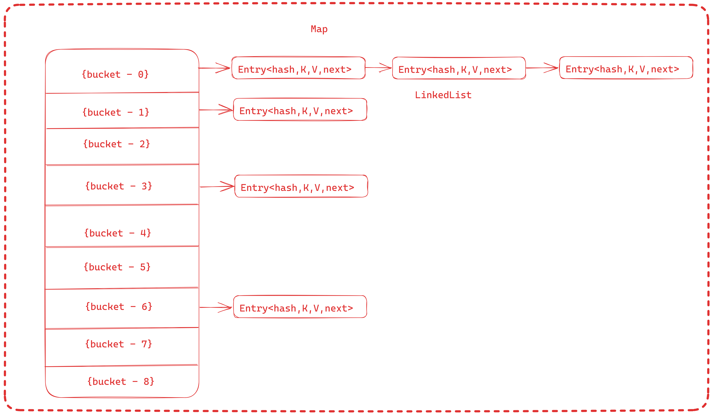
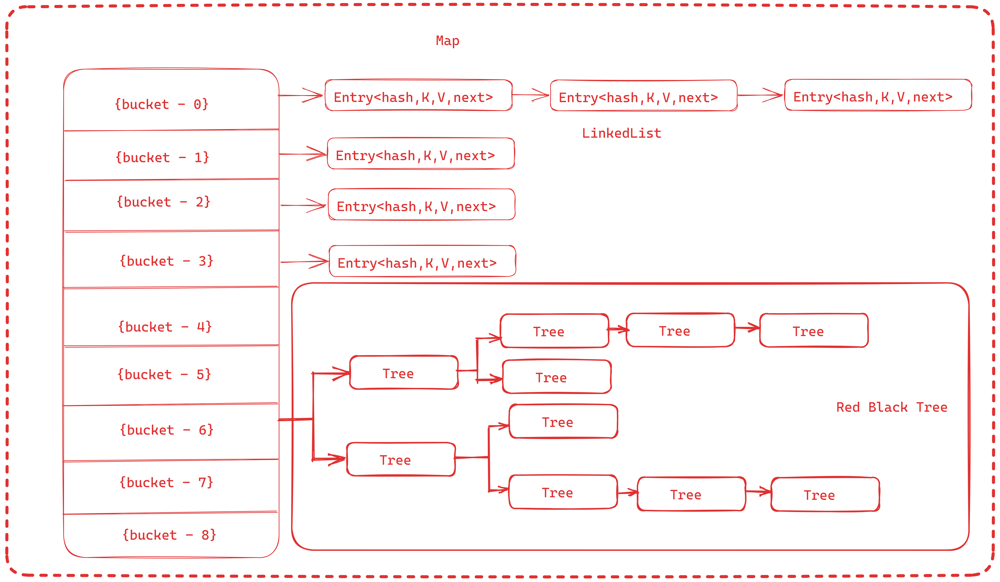

# FAIL FAST FAIL SAFE

## Fail Fast
### Iterators in java are used to iterate over the Collection objects. Fail-Fast iterators immediately throw ConcurrentModificationException if there is structural modification of the collection.
### Structural modification means adding, removing any element from collection while a thread is iterating over that collection. Iterator on ArrayList, HashMap classes are some examples of fail-fast Iterator.
### To know whether the collection is structurally modified or not, fail-fast iterators use an internal flag called modCount which is updated each time a collection is modified.
### Fail-fast iterators checks the modCount flag whenever it gets the next value (i.e. using next() method), and if it finds that the modCount has been modified after this iterator has been created, it throws ConcurrentModificationException.

## Fail Safe
### Fail-Safe iterators don’t throw any exceptions if a collection is structurally modified while iterating over it.
### This is because, they operate on the clone of the collection, not on the original collection and that’s why they are called fail-safe iterators.
### Iterator on CopyOnWriteArrayList, ConcurrentHashMap classes are examples of fail-safe Iterator.
#### <----------------------------------------------------------------------------------------------------------------------------------------------------------------------------------------------------------->
# Difference between Runnable and Callable

## Runnable

### Runnable is not a generic interface.
### The runnable interface has a run( ) method that does not return anything.
### Runnable does not provide Future object functionality.
### The run( ) method of the Runnable interface cannot throw a checked exception.
### It is a part of java.lang package.

## Callable

### Callable allows us to specify the type of result that will be returned by the call() method.
### The Callable interface has a call( ) method that returns a value.
### When a Callable is submitted to an ExecutorService, it returns a Future object that can be used to retrieve the result of the computation.
### The call( ) method of the Callable interface can throw an exception.
### It is a part of java.util.concurrent package.

#### <----------------------------------------------------------------------------------------------------------------------------------------------------------------------------------------------------------->
# Methods in Optional
### not
### empty
### get

#### <----------------------------------------------------------------------------------------------------------------------------------------------------------------------------------------------------------->
# Methods in stream()
### sorted
### collect
### limit
### findFirst
### map
### skip
### flatMap
### allMatch
### count
### dropWhile
### forEach
### unordered
### findAny
### toList
### max
### min
### reduce
### takeWhile
### peek
### noneMatch
### spliterator
### sequential
### forEachOrdered
#### <----------------------------------------------------------------------------------------------------------------------------------------------------------------------------------------------------------->
# What is difference between Collection and Stream
#### <----------------------------------------------------------------------------------------------------------------------------------------------------------------------------------------------------------->
# Parent child exception hierarchy 
### It is not allowed to child class overridden method to exception if parent class does not throw exception
### It will throw compile time exception
### When the parent class method doesn't throw any exceptions, the child class method can't throw any checked exception, but it may throw any unchecked exceptions.
### When the parent class method throws one or more checked exceptions, the child class method can throw any unchecked exception.
### When the parent class method has a throws clause with an unchecked exception, the child class method can throw none or any number of unchecked exceptions, even though they are not related.
#### <----------------------------------------------------------------------------------------------------------------------------------------------------------------------------------------------------------->
# What are access modifiers
### Public 
### Private 
### Protected
### Default
#### <----------------------------------------------------------------------------------------------------------------------------------------------------------------------------------------------------------->
# Difference Between Hashtable and ConcurrentHashMap in Java
### Both collections offer the advantage of thread safety, their underlying architectures and capabilities significantly differ.

## HashTable
### Primary selling point of Hashtable is thread safety, which is achieved through method-level synchronization.
### Methods like put(), putIfAbsent(), get(), and remove() are synchronized. Only one thread can execute any of these methods at a given time on a Hashtable instance, ensuring data consistency.

## ConcurrentHashMap
### ConcurrentHashMap is a more modern alternative, introduced with the Java Collections Framework as part of Java 5.
### Both Hashtable and ConcurrentHashMap implement the Map interface.

## Differences

## Concurrency
### Hashtable achieves thread safety through method-level synchronization
### ConcurrentHashMap, on the other hand, provides thread safety with a higher level of concurrency. It allows multiple threads to read and perform limited writes simultaneously without locking the entire data structure.

## Performance
### Hashtable locks the entire table during a write operation, thereby preventing other reads or writes. This could be a bottleneck in a high-concurrency environment.
### ConcurrentHashMap, however, allows concurrent reads and limited concurrent writes, making it more scalable and often faster in practice.

## Memory
### Hashtable uses a simple data structure, essentially an array of linked lists. Each bucket in this array stores one key-value pair, so there’s only the overhead of the array itself and the linked list nodes. There are no additional internal data structures to manage the concurrency level, load factor, or other advanced functionalities. Thus Hashtable consumes less memory overall.
#### <----------------------------------------------------------------------------------------------------------------------------------------------------------------------------------------------------------->
# Functional Interface before java8
### Runnable
#### <----------------------------------------------------------------------------------------------------------------------------------------------------------------------------------------------------------->
# What is the use of Functional Programming. 
### In Java, using Functional interfaces, programmers can pass a function as a parameter instead of a reference object, which reduces the amount of boilerplate code you have to write.
#### <----------------------------------------------------------------------------------------------------------------------------------------------------------------------------------------------------------->
# What is volatile in java.
#### <----------------------------------------------------------------------------------------------------------------------------------------------------------------------------------------------------------->
## Functional Interface in Java8.

#### <----------------------------------------------------------------------------------------------------------------------------------------------------------------------------------------------------------->
# Can we override static methods what happens if we add override on static method
### We can not, if we add @override throws exception
#### <----------------------------------------------------------------------------------------------------------------------------------------------------------------------------------------------------------->
# Singleton 
#### <----------------------------------------------------------------------------------------------------------------------------------------------------------------------------------------------------------->
# Immutable and create 
#### <----------------------------------------------------------------------------------------------------------------------------------------------------------------------------------------------------------->
# Method reference 
### Java provides a new feature called method reference in Java 8. Method reference is used to refer method of functional interface. 
### It is compact and easy form of lambda expression. Each time when you are using lambda expression to just referring a method, you can replace your lambda expression with method reference.
#### <----------------------------------------------------------------------------------------------------------------------------------------------------------------------------------------------------------->
# Constructor chaining

#### <----------------------------------------------------------------------------------------------------------------------------------------------------------------------------------------------------------->
# Difference between HashSet and TreeSet

#### <----------------------------------------------------------------------------------------------------------------------------------------------------------------------------------------------------------->
# Stream operations categories
## Intermediate Operations:
### An intermediate operation is always lazy, such as a simple Stream.map. It is not invoked until the stream is actually consumed. This can be verified easily:
### Intermediate operations are the common building blocks of a stream, chained after the source and are usually followed by a terminal operation triggering the stream chain.
## Terminal Operations
### Terminal operations are what triggers the consumption of a stream. Some of the more common are Stream.forEach or Stream.collect. 
### They are usually placed after a chain of intermediate operations and are almost always eager.
#### <----------------------------------------------------------------------------------------------------------------------------------------------------------------------------------------------------------->
# Difference between HashMap and HashTable
### HashMap is non-syncronized and is not thread safe while HashTable is thread safe and is synchronized.
### HashMap allows one null key and values can be null whereas HashTable doesn't allow null key or value.
### HashMap is faster than HashTable.
### HashMap iterator is fail-safe where HashTable iterator is not fail-safe.
### HashMap extends AbstractMap class where HashTable extends Dictionary class.
### In HashMap Threads are not required to wait and hence relatively performance is high.In It increases the waiting time of the thread and hence performance is low.
###
#### <----------------------------------------------------------------------------------------------------------------------------------------------------------------------------------------------------------->
# What is hash collision in java
### A collision, or more specifically, a hash code collision in a HashMap, is a situation where two or more key objects produce the same final hash value and hence point to the same bucket location or array index.
#### <----------------------------------------------------------------------------------------------------------------------------------------------------------------------------------------------------------->
# The Java hashCode() Method
### The hashCode() method is defined in Java Object class which computes the hash values of given input objects. 
### It returns an integer whose value represents the hash value of the input object. 
### The hashCode() method is used to generate the hash values of objects.
#### <----------------------------------------------------------------------------------------------------------------------------------------------------------------------------------------------------------->
# Collections in Java
#### <----------------------------------------------------------------------------------------------------------------------------------------------------------------------------------------------------------->
# If one thread adding data to ConcurrentHashMap and other thread iterating, does newly added values visible.
### It is guaranteed that things will not break if you do this (that's part of what the "concurrent" in ConcurrentHashMap means). However, there is no guarantee that one thread will see the changes to the map that the other thread performs (without obtaining a new iterator from the map).
#### <----------------------------------------------------------------------------------------------------------------------------------------------------------------------------------------------------------->
# java 8 HashMap changes
### To improve the working of HashMap, Java 8 made updates to the internal implementation workflow. 
### Once a certain threshold level is reached, the values are now automatically stored in a tree manner rather than a linked list. So instead of O(n) retrieval time, we now have better O(log n) retrieval performance.
#### <----------------------------------------------------------------------------------------------------------------------------------------------------------------------------------------------------------->
# Internal Working of HashMap: How HashMap Works?
### Java HashMap is a member of the Collections framework and stores key-value pairs. Each key is mapped to a single value, and duplicate keys are not allowed. In this tutorial, we will learn how HashMap internally stores the key-value pairs and how it prevents duplicate keys.
## Internal Implementation of HashMap
### The HashMap is a HashTable based implementation of the Map interface. It internally maintains an array, also called a “bucket array”. 
### The size of the bucket array is determined by the initial capacity of the HashMap, the default is 16.
### transient Node<K,V>[] table;
### Each index position in the array is a bucket that can hold multiple Node objects using a LinkedList.
   
### It is possible that multiple keys may produce the hash that maps them into a single bucket. This is why, the Map entries are stored as LinkedList.
### But when entries in a single bucket reach a threshold (TREEIFY_THRESHOLD, default value 8) then Map converts the bucket’s internal structure from the linked list to a RedBlackTree (JEP 180). All Entry instances are converted to TreeNode instances.
### Basically, when a bucket becomes too big, HashMap dynamically replaces it with an ad-hoc implementation of TreeMap. This way, rather than having a pessimistic O(n) performance, we get a much better O(log n).

### when nodes in a bucket reduce less than UNTREEIFY_THRESHOLD the Tree again converts to LinkedList. This helps balance performance with memory usage because TreeNodes takes more memory than Map.Entry instances. 
### So Map uses Tree only when there is a considerable performance gain in exchange for memory wastage.
## How Hashing is used to Locate Buckets?
### Hashing, in its simplest form, is a way to assign a unique code for any object after applying a formula/algorithm to its properties.
### A true hash function should return the same hash code every time the function is applied to the same or equal objects. In other words, two equal objects must consistently produce the same hash code.
### In Java, all objects inherit a default implementation of hashCode() function defined in Object class. It produces the hash code by typically converting the internal address of the object into an integer, thus producing different hash codes for all different objects.
### Java designers understood that end-user-created objects may not produce evenly distributed hash codes, so Map class internally applies another round of hashing function on the key’s hashcode() to make them reasonably distribute.
#### static final int hash(Object key) {
####   int h;
####   return (key == null) ? 0 : (h = key.hashCode()) ^ (h >>> 16);
#### }
### This is the final hash, generated from the initial hash of the Key object, that is the index of the array where Node should be searched.
## HashMap.put() Operation
### So far, we understood that each Java object has a unique hashcode associated with it, and this hashcode is used to decide the bucket location in the HashMap where the key-value pair will be stored.
### Before going into put() method’s implementation, it is very important to learn that instances of Node class are stored in an array. Each index location in the array is treated as a bucket:
### transient Node<K,V>[] table;
### To store a key-value pair, we invoke the put() API as follows:
### V put(K key, V value);
### The put() API, internally, first calculates the initial hash using the key.hashcode() method and then calculates the final hash using the hash() method discussed in the previous section.
### This final hash value is ultimately used to compute an index in the array or bucket location.
#### public V put(K key, V value) {
####    return putVal(hash(key), key, value, false, true);
#### }
### Once the bucket is located, HashMap stores the Node in it.
## How are Collisions Resolved in the Same Bucket?
### Here comes the main part now, as we know that two unequal objects can have the same hash code value, how two different objects will be stored in the same array location called a bucket.
### Node class had an attribute "next". This attribute always points to the next object in the chain. So, all the nodes with equal keys are stored in the same array index in the form of a LinkedList.
### When an Node object needs to be stored at a particular index, HashMap checks whether there is already a Node present in the array index?? If there is no Node already present, the current Node object is stored in this location.
### If an object is already sitting on the calculated index, its next attribute is checked. If it is null, and current Node object becomes next node in LinkedList. If next variable is not null, the process is followed until next is evaluated as null.
### When an Node object needs to be stored at a particular index, HashMap checks whether there is already a Node present in the array index?? If there is no Node already present, the current Node object is stored in this location. 
### If an object is already sitting on the calculated index, its next attribute is checked. If it is null, and current Node object becomes next node in LinkedList. If next variable is not null, the process is followed until next is evaluated as null.
#### if ((e = p.next) == null) {
####    p.next = newNode(hash, key, value, null);
####    break;
#### }
### Note that if the first node in the bucket is of type TreeNode then TreeNode.putTreeVal() is used to insert a new node in the red-black tree.
#### else if (p instanceof TreeNode)
####    e = ((TreeNode<K,V>)p).putTreeVal(this, tab, hash, key, value);  
### If the bucket is empty, the Node is stored directly in the array at the calculated index.
### If the bucket is not empty i.e. a Node exists already, the current Node is traversed in LinkedList style until the next node is empty or the keys match. Once we find the next to be empty, we store the current Node at the last of the LinkedList.
## HashMap.get() Operation
### The Map.get() API takes the key object ar method argument and returns the associated value, if it is found in the Map.
#### String val = map.get("key");
### Similar to the put() API, the logic to find the bucket location is similar to the get() API. Once the bucket is located using the final hash value, the first node at the index location is checked.
### If the first node is TreeNode type then TreeNode.getTreeNode(hash, key) API is used to search for the equal key object. If such a TreeNode is found, the value is returned.
#### if (first instanceOf TreeNode)
####   return ((TreeNode<K,V>)first).getTreeNode(hash, key);
### If the first node is not TreeNode then the search happens in the LinkedList fashion and the next attribute is checked in each iteration until the matching key object is found of a Node.
#### do {
####    if (e.hash == hash &&
####        ((k = e.key) == key || (key != null && key.equals(k))))
####        return e;
#### } while ((e = e.next) != null);
#### <----------------------------------------------------------------------------------------------------------------------------------------------------------------------------------------------------------->
# 
#### <----------------------------------------------------------------------------------------------------------------------------------------------------------------------------------------------------------->
#### <----------------------------------------------------------------------------------------------------------------------------------------------------------------------------------------------------------->
#### <----------------------------------------------------------------------------------------------------------------------------------------------------------------------------------------------------------->
#### <----------------------------------------------------------------------------------------------------------------------------------------------------------------------------------------------------------->
#### <----------------------------------------------------------------------------------------------------------------------------------------------------------------------------------------------------------->
#### <----------------------------------------------------------------------------------------------------------------------------------------------------------------------------------------------------------->

