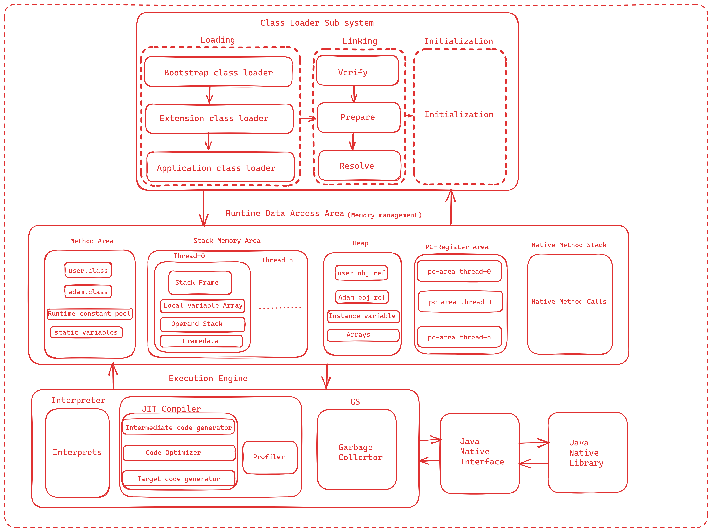

# JVM
### We knows that bytecode will be executed by the JRE (Java Runtime Environment). 
### But many don't know the fact that JRE is the implementation of Java Virtual Machine (JVM),which analyzes the bytecode, interprets the code, and executes it.
## What Is the JVM?
### A Virtual Machine is a software implementation of a physical machine. 
### Java was developed with the concept of WORA (Write Once Run Anywhere), which runs on a VM. The compiler compiles the Java file into a Java .class file, then that .class file is input into the JVM, which loads and executes the class file.

## Components of JVM?
### JVM has important components like
### 1). ClassLoader Subsystem
### 2). Data Access Area (Memory Management)
### 3). Execution Engine
### 4). Native Method Stack
## ClassLoader Subsystem
### ClassLoader subsystem do following 
#### a). Loading
#### b). Linking
#### c). Initialization
## a. Loading
### Loading means reading Class files and Store corresponding binary data in method area.
### For each Class file JVM will store fallowing info in Method Area
#### Fully qualified name of Class or Interface or Enum
#### Fully qualified name of it parent Class or Interface or enum
#### .class file related to Class or Interface or Enum
#### Modifier info
#### Variables info
#### Constantpool info
### After loading .class file, JVM create Class type Object in Heap Memory to represent binary information.
### we have 3 types of class loaders
#### i). Bootstrap classloader
#### ii). Extension Classloader
#### iii). Application classloader

### Fallowing is activity performed by each classloader
## i). Bootstrap classloader
### Responsible for loading classes from the bootstrap classpath, nothing but rt.jar. Highest priority will be given to this loader.
## ii). Extension Classloader
### Responsible for loading classes which are inside the ext folder (jre\lib).
## iii). Application classloader
### Responsible for loading Application Level Classpath,Current working directory path mentioned Environment Variable, etc.
## How does ClassLoader work?
### Whenever JVM come across any class jvm checks if class is already available.
### If already class is already loaded in method area, JVM use for there.
### If not already loaded JVM request class loader subsystem to load that specified class
### ClassLoader subsystem handover request to application classloader 
### Application classloader to delegates request to Extension Classloader
### Extension classloader to delegates request to Bootstrap Classloader
### Bootstrap classloader searches for .class file in bootstrap classpath location.
### if .class file is available it will load otherwise request will be delegated to Extension Classloader 
### Extension Classloader r searches for .class file in extension classpath location.
### if .class file is available it will be load otherwise request will be delegated to Application Classloader
### if .class file is available it will load, otherwise ClassNotFoundException or NoClassDefFoundError will be thrown
## b. Linking
### Linking has fallowing activities.
#### i). Verification 
#### ii). Preparation
#### iii). Resolution
## i. Verification
### Verification checks if binary representation of Class is valid or not
### JVM check if .class file generated by valid compiler and .class file formatted or not.
### Byte Code Verifier checks above verification
### If verification fails then runtime exception is thrown java.long.VerifyError
## ii. Preparation
### JVM allocates memory for class level static variables and assigns default value.
## iii. Resolution
### All symbolic memory references are replaced with the original references from Method Area.
## c). Initialization
### Static variables assigned with original values and static block execution will be performed for parent class to child class

