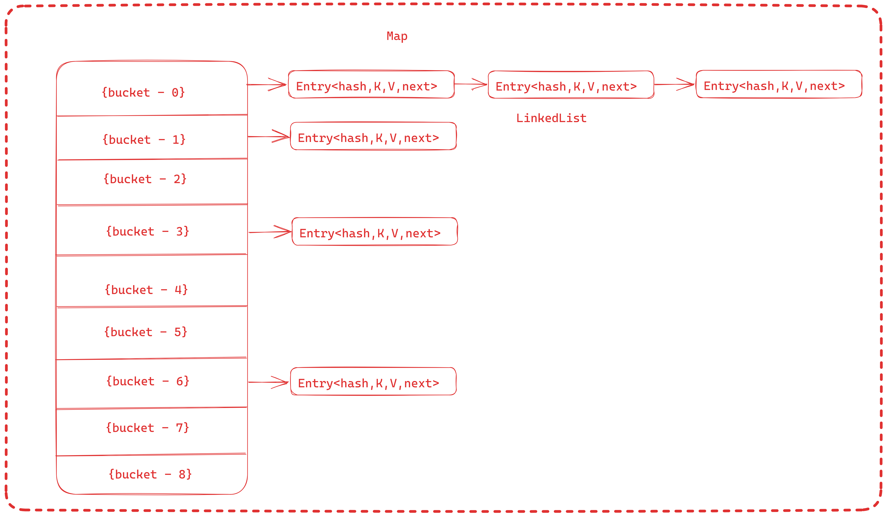
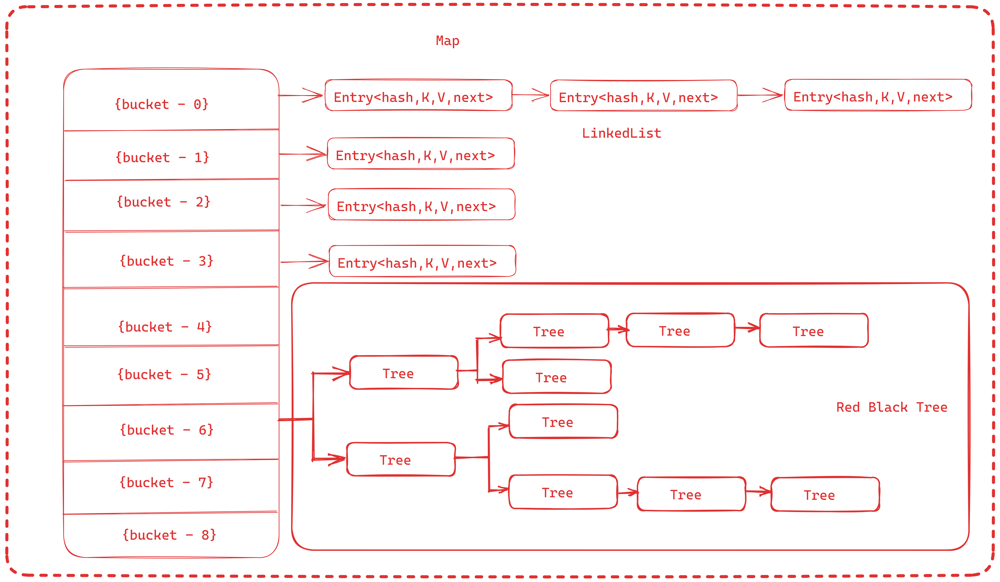

# Internal Working of HashMap: How HashMap Works?
### Java HashMap is a member of the Collections framework and stores key-value pairs. Each key is mapped to a single value, and duplicate keys are not allowed. we will learn how HashMap internally stores the key-value pairs and how it prevents duplicate keys.
## Internal Implementation of HashMap
### The HashMap is a HashTable based implementation of the Map interface. It internally maintains an array, also called a “bucket array”.
### The size of the bucket array is determined by the initial capacity of the HashMap, the default is 16.
### transient Node<K,V>[] table;
### Each index position in the array is a bucket that can hold multiple Node objects using a LinkedList.

### It is possible that multiple keys may produce the hash that maps them into a single bucket. This is why, the Map entries are stored as LinkedList.
### But when entries in a single bucket reach a threshold (TREEIFY_THRESHOLD, default value 8) then Map converts the bucket’s internal structure from the linked list to a RedBlackTree (JEP 180). All Entry instances are converted to TreeNode instances.
### Basically, when a bucket becomes too big, HashMap dynamically replaces it with an ad-hoc implementation of TreeMap. This way, rather than having a pessimistic O(n) performance, we get a much better O(log n).

### when nodes in a bucket reduce less than UNTREEIFY_THRESHOLD the Tree again converts to LinkedList. This helps balance performance with memory usage because TreeNodes takes more memory than Map.Entry instances.
### So Map uses Tree only when there is a considerable performance gain in exchange for memory wastage.
## How Hashing is used to Locate Buckets?
### Hashing, in its simplest form, is a way to assign a unique code for any object after applying a formula/algorithm to its properties.
### A true hash function should return the same hash code every time the function is applied to the same or equal objects. In other words, two equal objects must consistently produce the same hash code.
### In Java, all objects inherit a default implementation of hashCode() function defined in Object class. It produces the hash code by typically converting the internal address of the object into an integer, thus producing different hash codes for all different objects.
### Java designers understood that end-user-created objects may not produce evenly distributed hash codes, so Map class internally applies another round of hashing function on the key’s hashcode() to make them reasonably distribute.
#### static final int hash(Object key) {
####   int h;
####   return (key == null) ? 0 : (h = key.hashCode()) ^ (h >>> 16);
#### }
### This is the final hash, generated from the initial hash of the Key object, that is the index of the array where Node should be searched.
## HashMap.put() Operation
### So far, we understood that each Java object has a unique hashcode associated with it, and this hashcode is used to decide the bucket location in the HashMap where the key-value pair will be stored.
### Before going into put() method’s implementation, it is very important to learn that instances of Node class are stored in an array. Each index location in the array is treated as a bucket:
### transient Node<K,V>[] table;
### To store a key-value pair, we invoke the put() API as follows:
### V put(K key, V value);
### The put() API, internally, first calculates the initial hash using the key.hashcode() method and then calculates the final hash using the hash() method discussed in the previous section.
### This final hash value is ultimately used to compute an index in the array or bucket location.
#### public V put(K key, V value) {
####    return putVal(hash(key), key, value, false, true);
#### }
### Once the bucket is located, HashMap stores the Node in it.
## How are Collisions Resolved in the Same Bucket?
### Here comes the main part now, as we know that two unequal objects can have the same hash code value, how two different objects will be stored in the same array location called a bucket.
### Node class had an attribute "next". This attribute always points to the next object in the chain. So, all the nodes with equal keys are stored in the same array index in the form of a LinkedList.
### When an Node object needs to be stored at a particular index, HashMap checks whether there is already a Node present in the array index?? If there is no Node already present, the current Node object is stored in this location.
### If an object is already sitting on the calculated index, its next attribute is checked. If it is null, and current Node object becomes next node in LinkedList. If next variable is not null, the process is followed until next is evaluated as null.
### When an Node object needs to be stored at a particular index, HashMap checks whether there is already a Node present in the array index?? If there is no Node already present, the current Node object is stored in this location.
### If an object is already sitting on the calculated index, its next attribute is checked. If it is null, and current Node object becomes next node in LinkedList. If next variable is not null, the process is followed until next is evaluated as null.
#### if ((e = p.next) == null) {
####    p.next = newNode(hash, key, value, null);
####    break;
#### }
### Note that if the first node in the bucket is of type TreeNode then TreeNode.putTreeVal() is used to insert a new node in the red-black tree.
#### else if (p instanceof TreeNode)
####    e = ((TreeNode<K,V>)p).putTreeVal(this, tab, hash, key, value);
### If the bucket is empty, the Node is stored directly in the array at the calculated index.
### If the bucket is not empty i.e. a Node exists already, the current Node is traversed in LinkedList style until the next node is empty or the keys match. Once we find the next to be empty, we store the current Node at the last of the LinkedList.
## HashMap.get() Operation
### The Map.get() API takes the key object ar method argument and returns the associated value, if it is found in the Map.
#### String val = map.get("key");
### Similar to the put() API, the logic to find the bucket location is similar to the get() API. Once the bucket is located using the final hash value, the first node at the index location is checked.
### If the first node is TreeNode type then TreeNode.getTreeNode(hash, key) API is used to search for the equal key object. If such a TreeNode is found, the value is returned.
#### if (first instanceof TreeNode)
####   return ((TreeNode<K,V>)first).getTreeNode(hash, key);
### If the first node is not TreeNode then the search happens in the LinkedList fashion and the next attribute is checked in each iteration until the matching key object is found of a Node.
#### do {
####    if (e.hash == hash &&
####        ((k = e.key) == key || (key != null && key.equals(k))))
####        return e;
#### } while ((e = e.next) != null);