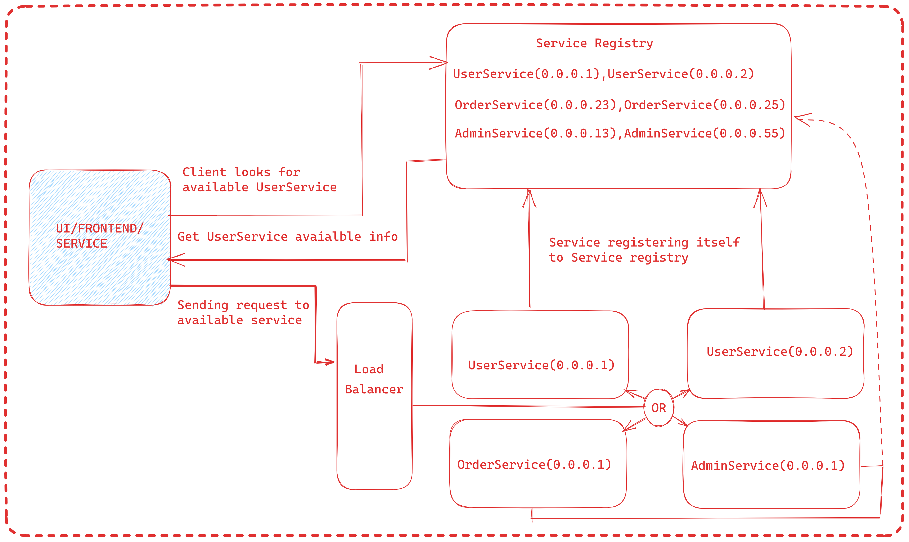

# MicroService
#### <----------------------------------------------------------------------------------------------------------------------------------------------------------------------------------------------------------->
## MicroService & Monolith difference.
### Microservices architecture: services are designed to be small, autonomous, and loosely coupled. This design philosophy provides many benefits, including scalability, flexibility, and faster development cycles.
#### <----------------------------------------------------------------------------------------------------------------------------------------------------------------------------------------------------------->
## What are principles microservice architecture ?
### a). Scalability
### b). Availability
### c). Resiliency
### d). Independent, autonomous
### e). Decentralized governance
### f). Failure isolation
### g). Auto-Provisioning
### h). Continuous delivery through DevOps
#### <----------------------------------------------------------------------------------------------------------------------------------------------------------------------------------------------------------->
# The Twelve Factor App
## a). Codebase
### One codebase tracked in revision control, many deploys
## b). Dependencies
### Explicitly declare and isolate dependencies
## c). Config
### Store config in the environment
## d). Backing services
### Treat backing services as attached resources
## e). Build, release, run
### Strictly separate build and run stages
## f). Processes
### Execute the app as one or more stateless processes
## g). Port binding
### Export services via port binding
## h). Concurrency
### Scale out via the process model
## i). Disposability
### Maximize robustness with fast startup and graceful shutdown
## j). Dev/prod parity
### Keep development, staging, and production as similar as possible
## k). Logs
### Treat logs as event streams
## l). Admin processes
### Run admin/management tasks as one-off processes
#### <----------------------------------------------------------------------------------------------------------------------------------------------------------------------------------------------------------->
## Transaction Management in MicroService.
### What are Distributed Transactions in Microservices?
#### When a microservice architecture decomposes a monolithic system into self-encapsulated services, it can break transactions. 
#### This means a local transaction in the monolithic system is now distributed into multiple services that will be called in a sequence.
#### A distributed transaction involves multiple services that need to work together to complete a transaction. 
#### In a microservices architecture, each service may have its own database, and transactions that require data from multiple services may need to coordinate the work of all these services to ensure that the transaction is completed successfully.
#### Consider user placing order from amazon microservice if ordering and payment steps are successful then all transactions are committed.

#### Consider user placing order from amazon microservice if ordering or payment any step is failed  then all transactions are rolled back.

#### When we split monolith system to microservice, we created both the OrderService and the PaymentService, which have separate databases.
#### Each microservice has it own local transaction.

## Challenges of Managing Distributed Transactions in Microservices?
### Complexity
#### Managing transactions across multiple services can be complex, and coordinating the work of all these services can be challenging.
### Failure Handling
#### In a distributed system, failures are inevitable, and handling these failures in a distributed transaction can be challenging.
### Scalability
#### Microservices architecture is designed to be scalable, and managing transactions across multiple services can be challenging in a highly scalable environment.
### Latency
#### Coordinating the work of multiple services can introduce latency, which can impact the performance of the system.
## 6 Ways to Manage Distributed Transactions in Microservices?
### 1. Two-Phase Commit (2PC)
#### 2pc has two phases: A prepare phase and a commit phase. In the prepare phase, all microservices will be asked to prepare for some data change that could be done atomically. 
#### Once all microservices are prepared, the commit phase will ask all the microservices to make the actual changes.
#### Two-phase commit is a protocol used to ensure that all participants in a distributed transaction agree to commit or abort the transaction. 
#### In this approach, a coordinator service is responsible for coordinating the work of all the services involved in the transaction.
#### The coordinator asks all the services to prepare for the transaction, and if all the services are ready, the coordinator sends a commit message to all the services. 
#### If any of the services fail to prepare or respond, the coordinator sends an abort message to all the services. 
### 2. Saga Pattern
#### The Saga pattern is a pattern used to manage long-running transactions in a distributed system. 
#### In this pattern, each service involved in the transaction performs a local transaction and sends a message to the next service to perform its transaction.
#### If any of the services fail, the Saga can be rolled back by sending a compensating transaction to undo the work that has already been done.
### 3. Event-Driven Architecture
#### Event-driven architecture is an architectural pattern that involves the use of events to trigger actions in a system. 
#### In a distributed transaction, each service can publish events when it has completed its part of the transaction. Other services can then subscribe to these events and perform their part of the transaction.
### 4. Use Idempotent Operations
#### Idempotent operations are operations that can be repeated without changing the outcome. 
#### In a distributed system, using idempotent operations can help ensure that the same operation is not performed twice, even if it is retried due to a failure.
#### For example, if a service is trying to update a record in a database, it can check if the record already exists before performing the update operation. 
#### If the record already exists, the service can skip the update operation and return a success response.
### 5. Implement Retry and Timeout Mechanisms
#### In a distributed system, network failures and timeouts are common. Implementing retry and timeout mechanisms can help handle these failures gracefully.
#### For example, if a service fails to respond to a request, the client can retry the request a few times before giving up.
#### Similarly, if a service takes too long to respond, the client can timeout the request and handle the failure gracefully.
### 6. Use a Distributed Transaction Coordinator
#### A distributed transaction coordinator is a service that manages distributed transactions in a microservices architecture. 
#### It provides a centralized mechanism for coordinating the work of all the services involved in a transaction.
#### The coordinator can ensure that all the services commit or abort the transaction in a coordinated manner, even in the event of failures.
#### <----------------------------------------------------------------------------------------------------------------------------------------------------------------------------------------------------------->
## Fault Tolerance in MicroService. 
#### <----------------------------------------------------------------------------------------------------------------------------------------------------------------------------------------------------------->
## How two microservice communicate in spring 
### 1). In synchronous way we can use(HTTP communication)
###     a). RestTemplate
###     b). FeignClient
### 2). In asynchronous way we can use
###     a). JMS Message broker
###     b). Kafka broker
###            Or
### 3). Event-driven
### 1). HTTP communication
#### HTTP calls between services is a viable option for service-to-service communication.
#### Services directly communicates with each other.
#### Here we have two options
#### a). Synchronous :
#### This is blocking communication 
#### eg. RestTemplate
#### Services are tightly coupled.
#### b). Asynchronous 
#### This is non-blocking communication 
#### eg. WebFlux 
#### Services are loosely coupled.
### 2). Message communication
#### Unlike HTTP communication, the services involved do not directly communicate with each other. Instead, the services push messages to a message broker that other services subscribe to. 
#### This eliminates a lot of complexity associated with HTTP communication.
#### It doesn’t require services to know how to talk to one another; it removes the need for services to call each other directly. Instead, all services know of a message broker, and they push messages to that broker. 
#### Other services can choose to subscribe to the messages in the broker that they care about.
### 3). Event-driven communication
#### This is another asynchronous approach, and it looks to remove the coupling between services altogether.
#### Unlike the messaging pattern where the services must know of a common message structure, an event-driven approach doesn’t need this.
#### Communication between services takes place via events that individual services produce.
#### A message broker is still needed here since individual services will write their events to it. 
#### But, unlike the message approach, the consuming services don’t need to know the details of the event; they react to the occurrence of the event, not the message the event may or may not deliver.
#### <----------------------------------------------------------------------------------------------------------------------------------------------------------------------------------------------------------->
## Service Discovery Pattern in Microservices
### The service discovery pattern uses a centralized server named “service registry” to maintain a global view of microservices’ network locations. 
### Microservices update their locations in the service registry at fixed intervals. Clients can connect to the service registry and fetch the locations of microservices.
### How Does Service Discovery Work?
### There are 3 participants in the service discovery pattern:
### 1). Service registry : The service registry keeps records of the network locations of the microservices. Microservice instances register themselves and provide their locations to the service registry.
### 2). Client : clients can find the locations of microservices using the service registry and directly call them to fulfill its need.
### 3). Service consumers (Microservices) : Is service which provides response to client and gets themself registered with service registry.
 
### Here, we can break the service discovery communication flow into 4 parts:

### 1). First, the service provider registers its location in the service registry.
### 2). The client looks for relevant service locations in the service registry.
### 3). The service registry returns the location of the required microservice.
### 4). The client directly calls the microservice.
### There are 2 main service discovery patterns available to implement service discovery for microservices.
### 1). Client-side service discovery
  
### In the Client-side service discovery pattern, the client is responsible for finding the network locations of microservices and loading balancing requests between them.
### Advantages of Client-side Service Discovery
### a). It is straightforward and easy to understand.
### b). The service registry is the only moving part.
### c). The client knows the locations of microservices before sending the request.
### d). The client can make intelligent load balancing decisions with its dedicated load balancer.
### Disadvantages of Client-side Service Discovery
### a). The client is responsible for implementing service discovery logic.
### b). The client is coupled with the service registry.
### c). Need to implement service discovery logic for each language used by your clients.
### 2). Server-side service discovery

### The Server-side discovery pattern solves one of the significant issues in Client-side discovery by decoupling the client and the services registry. 
### In this approach, the client does not have a dedicated load balancer. Instead, the load balancer acts as a middle man and is responsible for communicating with the service registry.
### First, the client requests a microservice through the load balancer. Then, the load balancer queries the service registry and finds the location of the relevant microservice. 
### Finally, the load balancer routes the request to the microservice.
### This pattern is widely used in modern applications since both clients and microservices are independent of the service registry. Most importantly, you don’t need to implement the Server-side discover load balancers from scratch since many deployment environments provide load balancers.
### For example, you can use AWS Elastic Load Balancer or proxies on the Kubernetes environments as Server‑side discovery load balancers.
### Advantages of Server-side Service Discovery
### a). The service registry is decoupled from the client.
### b). There is no need to implement service discovery logic for each language your clients use.
### c). Can use load balancers provided by deployment environments.
### Disadvantages of Server-side Service Discovery
### a). If the deployment environment does not provide, developers need to create and manage load balancers.
#### <----------------------------------------------------------------------------------------------------------------------------------------------------------------------------------------------------------->
#### <----------------------------------------------------------------------------------------------------------------------------------------------------------------------------------------------------------->
#### <----------------------------------------------------------------------------------------------------------------------------------------------------------------------------------------------------------->
#### <----------------------------------------------------------------------------------------------------------------------------------------------------------------------------------------------------------->
#### <----------------------------------------------------------------------------------------------------------------------------------------------------------------------------------------------------------->
#### <----------------------------------------------------------------------------------------------------------------------------------------------------------------------------------------------------------->
#### <----------------------------------------------------------------------------------------------------------------------------------------------------------------------------------------------------------->
#### <----------------------------------------------------------------------------------------------------------------------------------------------------------------------------------------------------------->
#### <----------------------------------------------------------------------------------------------------------------------------------------------------------------------------------------------------------->
#### <----------------------------------------------------------------------------------------------------------------------------------------------------------------------------------------------------------->
#### <----------------------------------------------------------------------------------------------------------------------------------------------------------------------------------------------------------->
#### <----------------------------------------------------------------------------------------------------------------------------------------------------------------------------------------------------------->
#### <----------------------------------------------------------------------------------------------------------------------------------------------------------------------------------------------------------->
#### <----------------------------------------------------------------------------------------------------------------------------------------------------------------------------------------------------------->
#### <----------------------------------------------------------------------------------------------------------------------------------------------------------------------------------------------------------->
#### <----------------------------------------------------------------------------------------------------------------------------------------------------------------------------------------------------------->
#### <----------------------------------------------------------------------------------------------------------------------------------------------------------------------------------------------------------->
#### <----------------------------------------------------------------------------------------------------------------------------------------------------------------------------------------------------------->
#### <----------------------------------------------------------------------------------------------------------------------------------------------------------------------------------------------------------->
#### <----------------------------------------------------------------------------------------------------------------------------------------------------------------------------------------------------------->
#### <----------------------------------------------------------------------------------------------------------------------------------------------------------------------------------------------------------->
#### <----------------------------------------------------------------------------------------------------------------------------------------------------------------------------------------------------------->
#### <----------------------------------------------------------------------------------------------------------------------------------------------------------------------------------------------------------->

